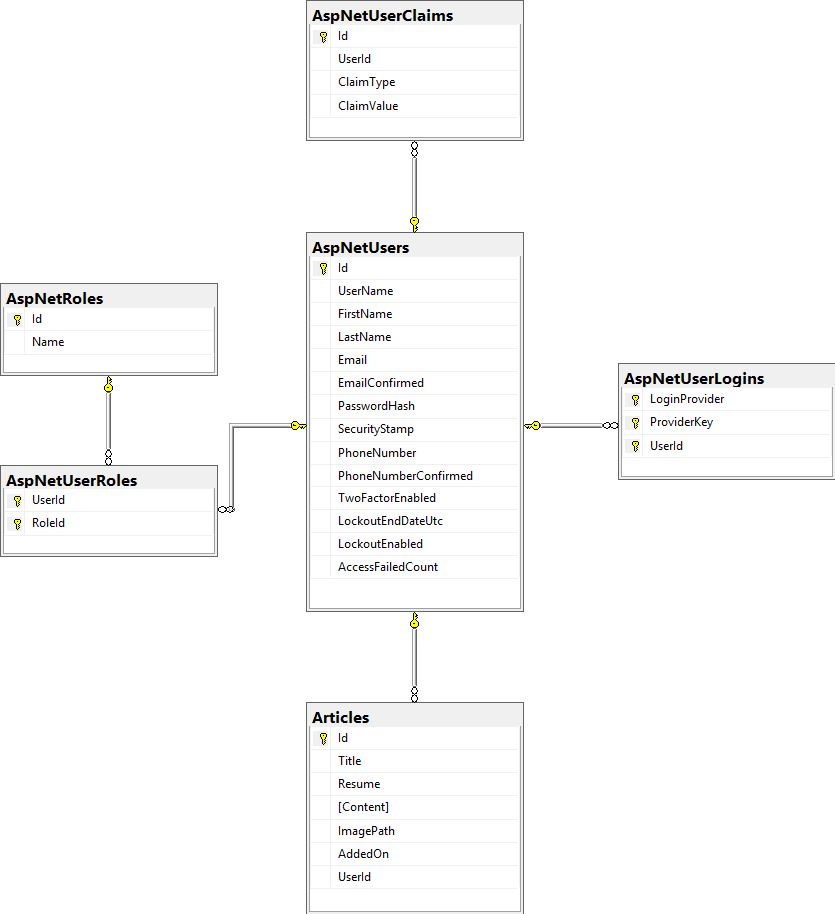
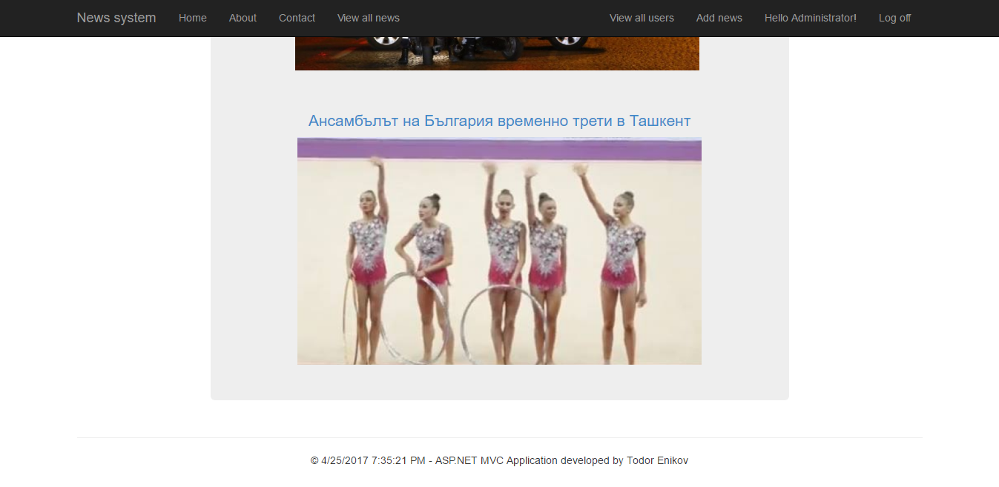
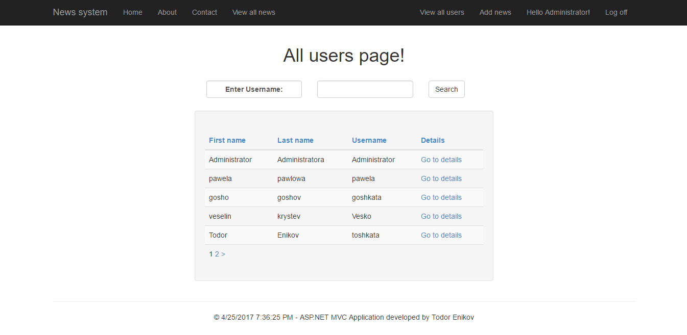
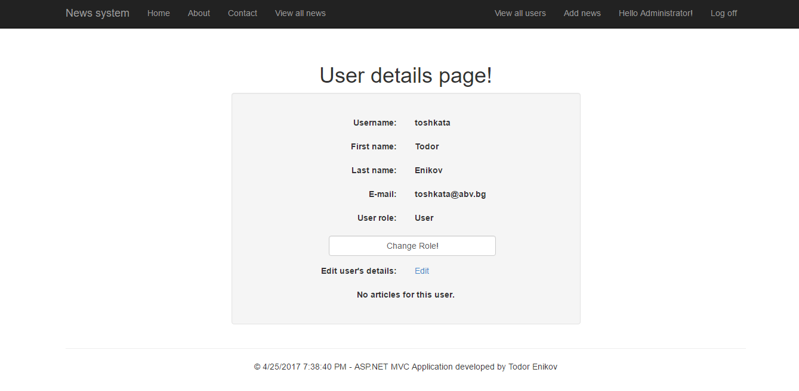
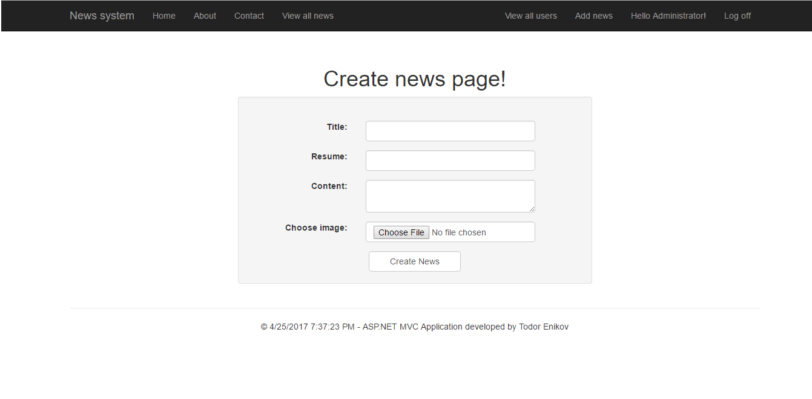

# News-System-ASP.NET-MVC-Project
Project for SQL and Network Technologies for access to DataBase subject in TU-Sofia.

### Project desctiption:
#### ASP.NET MVC News system application.
This is application made on ASP .NET MVC. It's purpose is to create news by user with role Administrator. The application has administration panel and only user with role "Administrator", can create news, edit news, delete news, see all users, edit information of given user, change role of given user.

Roles in the application and what can they visit.
* Administrator - can visit all pages in the application.
* Regular user - can visit home, about, contact, profile, view all news pages.
* Not registered user - can see only home, about, contact, login, register, view all news pages.

### Diagram on the Data Base:

### Images from the application:

## GitHub repository:

https://github.com/todor-enikov/News-System-ASP.NET-MVC-Project
